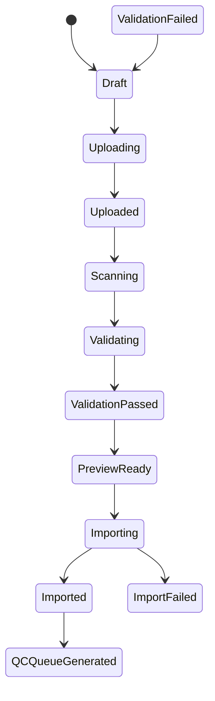

# 后端架构设计文档

## 1. 技术栈
- FastAPI + SQLAlchemy async, PostgreSQL, Redis, MinIO, Meilisearch, Milvus Lite, Celery + Redis

## 2. 模块划分
- 数据导入, 标注管理, QC, 搜索, 导出, 权限, 分析

## 3. 状态机示意

## 4. 数据库 Schema
- RawAsset, PreAnnotationStep1, PreAnnotationStep2, HumanReview, AuditArtifact
